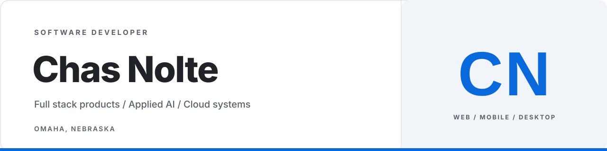
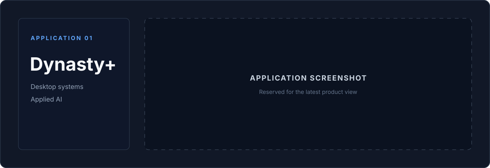
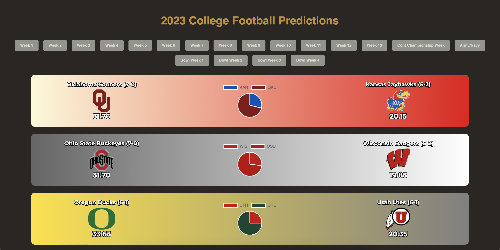
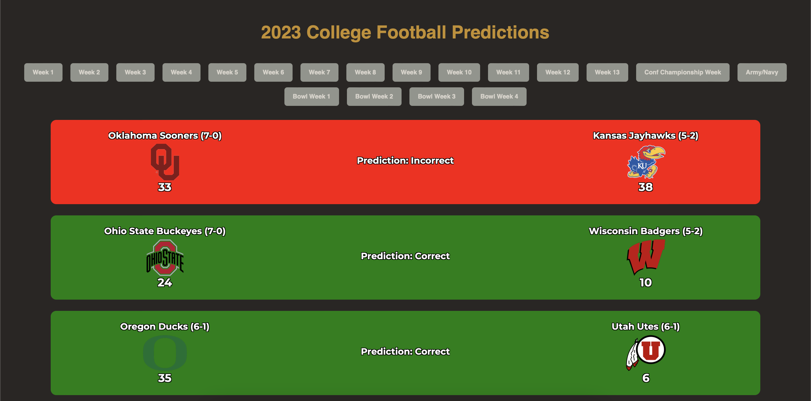
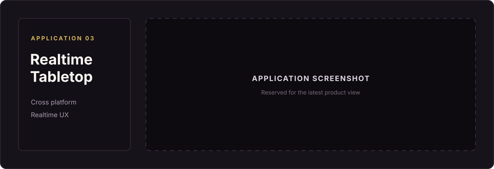
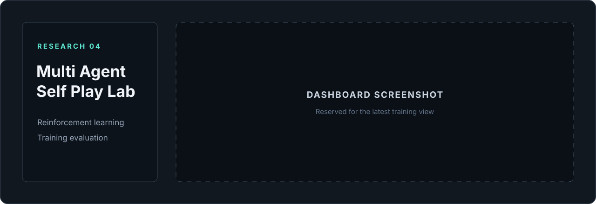

<picture>
  <source media="(prefers-color-scheme: dark)" srcset="./assets/profile-hero-dark.svg">
  <source media="(prefers-color-scheme: light)" srcset="./assets/profile-hero-light.svg">
  
</picture>

## About

I build complete software products across web, mobile, desktop, and cloud. I hold an M.S. in Computer Science with an AI concentration, and I am most effective where product design, systems engineering, and applied machine learning meet.

[LinkedIn](https://www.linkedin.com/in/chasnolte) · [Email](mailto:noltechas@yahoo.com)

| Product engineering | Applied AI | Platform delivery |
|---|---|---|
| React, React Native, Electron | PyTorch, TensorFlow, LLM systems | AWS, Azure, Supabase |
| Cross platform UX | Training, inference, evaluation | APIs, data pipelines, CI/CD |

## Selected work

### 01 / Dynasty+

*Current build · Desktop systems · Applied AI*

An Electron, React, Flask, and Python companion platform that turns complex game save data into an interactive management experience.

  

- Reads reverse engineered save formats and handles unavailable local data without breaking the core experience.
- Packages two product editions from one codebase with persistent narrative memory, deterministic caching, and modular LLM features.

*Private development. Architecture walkthrough available on request.*

---

### 02 / [College Football Forecasting System](https://github.com/noltechas/CapstoneFPI)

*Graduate capstone · Machine learning · Data engineering*

A deep learning pipeline for predicting college football winners, win probabilities, and final scores from historical game data.

  
  

- Engineered nearly 200,000 data records and more than 2,000 game level features stored in Azure SQL.
- Trained and evaluated models across 14,204 games, reaching 76% winner prediction accuracy on a held out season.

---

### 03 / Realtime Tabletop Operations

*Current build · Cross platform · Realtime UX*

A host and player system for running social deduction games across an Electron desktop app and an Expo React Native companion.

  

- Separates private host state from the public room display while synchronizing players through short codes and QR onboarding.
- Uses a pure TypeScript rules engine, shared domain packages, and tested state transitions for nominations, voting, and role actions.

*Private development. Product demo available on request.*

---

### 04 / Multi Agent Self Play Lab

*Research build · Reinforcement learning · Evaluation*

A multi agent reinforcement learning environment for imperfect information games, built around self play and measurable training behavior.

  

- Combines MAPPO, population based league play, and auxiliary belief modeling to study strategy under hidden information.
- Includes 137 automated tests and a live Flask dashboard for training metrics, checkpoints, and replay inspection.

*Private research code. Methodology walkthrough available on request.*

## Core toolkit

`TypeScript` · `Python` · `C#` · `React` · `React Native` · `Node.js` · `.NET` · `Electron` · `AWS` · `Azure` · `Supabase` · `PyTorch` · `TensorFlow`

---

Based in Omaha, Nebraska. If you are building a product where polished UX has to meet complex systems, [send me an email](mailto:noltechas@yahoo.com).
