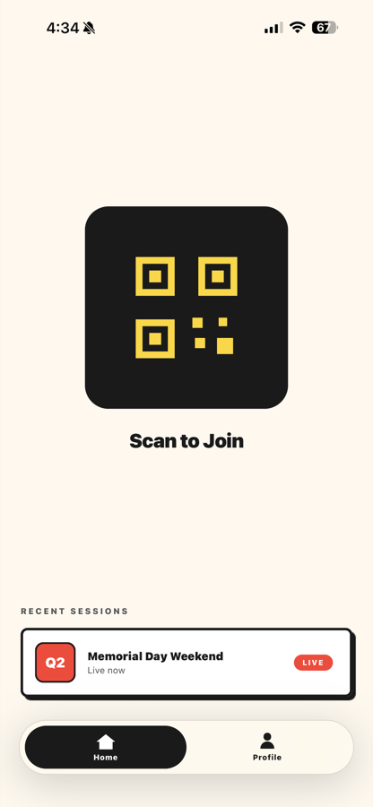
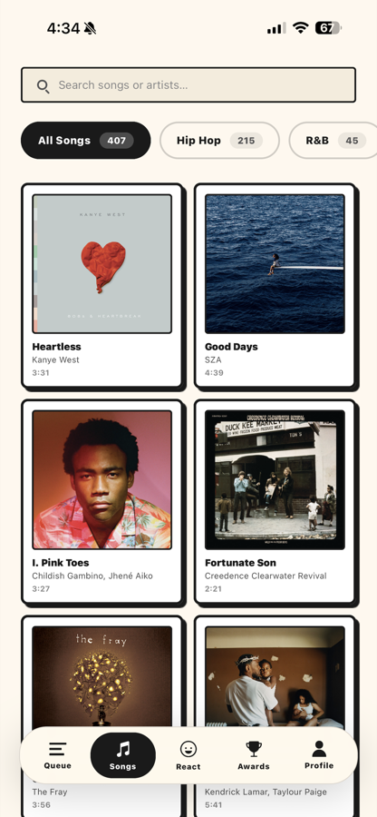
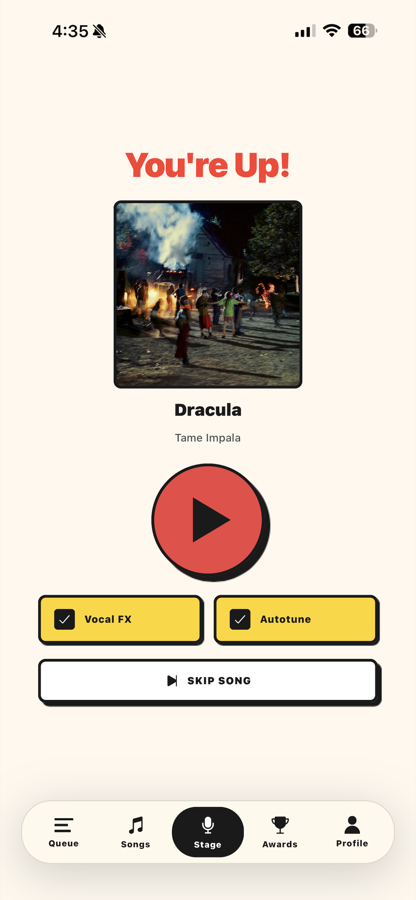
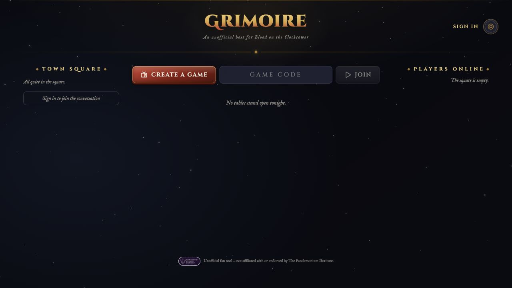
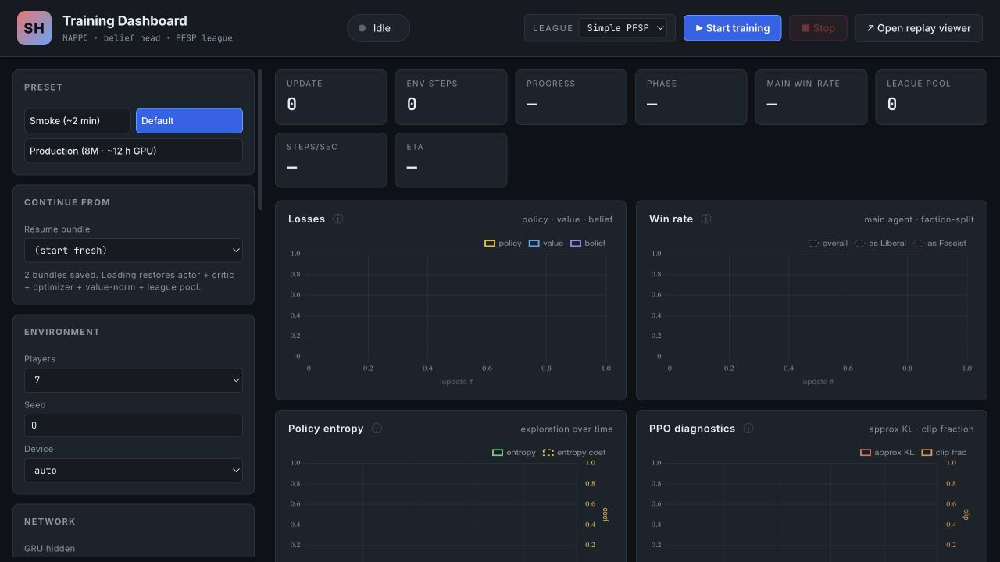

<picture>
  <source media="(prefers-color-scheme: dark)" srcset="./assets/profile-hero-dark.svg">
  <source media="(prefers-color-scheme: light)" srcset="./assets/profile-hero-light.svg">
  
</picture>

## About

I build complete software products across web, mobile, desktop, and cloud. I hold an M.S. in Computer Science with an AI concentration, and I am most effective where product design, systems engineering, and applied machine learning meet.

[LinkedIn](https://www.linkedin.com/in/chasnolte) · [Email](mailto:noltechas@yahoo.com)

| Product engineering | Applied AI | Platform delivery |
|---|---|---|
| React, React Native, Electron | PyTorch, TensorFlow, LLM systems | AWS, Azure, Supabase |
| Cross platform UX | Training, inference, evaluation | APIs, data pipelines, CI/CD |

## Selected work

### 01 / [CFB Predictor](https://github.com/noltechas/CapstoneFPI)

*Graduate capstone · Machine learning · Data engineering*

A deep learning pipeline for predicting college football winners, win probabilities, and final scores from historical game data.

  
  

- Engineered nearly 200,000 data records and more than 2,000 game level features stored in Azure SQL.
- Trained and evaluated models across 14,204 games, reaching 76% winner prediction accuracy on a held out season.

---

### 02 / [Realtime Karaoke](https://github.com/noltechas/Realtime)

*Shipped product · Desktop and mobile · Realtime systems*

A cross platform karaoke platform built as an Electron desktop experience and a React Native iOS companion, with shared TypeScript packages and synchronized room state.

  
  
  

- Connects the desktop host and mobile guests through Supabase for room state, queue management, and synchronized interactions.
- Combines Spotify integration and Three.js visuals with a reusable monorepo architecture spanning desktop, mobile, and shared domain code.

---

### 03 / Blood on the Clocktower Companion

*Current build · Desktop and mobile · Rules engine*

A two part companion system with an Electron Storyteller host, a public room display, and an Expo React Native player app.

  

- Separates private Storyteller state from the public display while players join through short codes or QR onboarding.
- Uses a tested TypeScript rules engine to manage night order, role information, nominations, voting, reminders, and win detection while keeping the Storyteller in control.

*Private development. Product demo available on request.*

---

### 04 / Social Deduction ML

*Research build · Multi agent reinforcement learning · Evaluation*

A reinforcement learning laboratory for training agents in imperfect information social deduction environments through self play and structured evaluation.

  

- Combines MAPPO, prioritized fictitious self play, and auxiliary belief modeling to study strategy under hidden information.
- Includes 137 automated tests and a live Flask dashboard for training metrics, checkpoints, and replay inspection.

*Private research code. Methodology walkthrough available on request.*

## Core toolkit

`TypeScript` · `Python` · `React` · `React Native` · `Expo` · `Electron` · `Node.js` · `Flask` · `Supabase` · `PostgreSQL` · `Azure` · `PyTorch` · `TensorFlow`

---

Based in Omaha, Nebraska. If you are building a product where polished UX has to meet complex systems, [send me an email](mailto:noltechas@yahoo.com).
