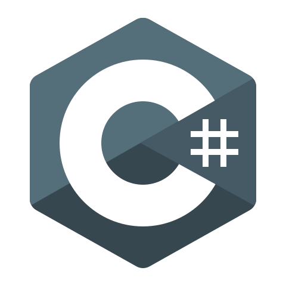
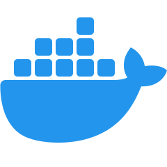

# 🏊🏼‍♂️️ Chas Nolte

**`Software Engineer (Developer/Athlete/Creator)`**

I am a full-stack developer currently pursuing my Masters degree in computer science 
with a concentration in Artificial Intelligence.
All coding projects are built from the ground up, from planning and designing all the way to solving real-life problems with code.
Projects in this repository were built both in a university setting and by myself based on my personal interests.

---

## 🛠️ Languages and Tools

    
    
    
    
    
    
    
    
    
    
    
    
    
    

---------

## 🚀 Projects

### [Swim Stroke Analyzer](https://github.com/noltechas/SwimAI)
###### Completed December 2023
For my final project in my Advanced Artificial Intelligence class, I decided to create
a project that analyzes a swimmer's stroke technique. As a collegiate swimmer, the idea
of this project was very interesting to me, as it applied to a sport that I was
competing in and practicing many hours a day. The final project used machine learning algorithms 
built with Keras and Tensorflow to successfully detect the location of the swimmer's
hands and feet throughout a given video. From there, the program measured the symmetry of the
swimmer's features to give accurate feedback to how well the swimmer was performing
their stroke.

  

_The example above shows the neural network's detections of the swimmer's body, as well as the detections
for both their hands and feet. The software then connects the center of the hand and foot bounding
boxes with a line, which is colored green in frames where they are symmetrical to each other, and fading
to red the more asymmetrical they are. In the top left corner, you can see the average angle of these lines
to measure symmetry throughout the entire video._

---

### [College Football Score and Victory Predictor](https://github.com/noltechas/CapstoneFPI)
###### Completed May 2024
For my graduate-level capstone project, I designed and trained a deep neural network to predict
win probabilities and final scores for college football games. The data required for the project was stored
in a SQL database using Microsoft Azure, and totaled nearly 200,000 entries for individual and team game statistics from college
football games from 2013 to 2023. Once the Azure databases were completed, JavaScript functions were developed to retrieve
and process the data, calculating advanced statistics such as Quarterback Rating, Strength of Record, and Blue-Chip ratio to name a few.

From there, the neural network architecture was developed using Tensorflow and Keras, taking in over 2000 unique statistics for
each game. In total, the neural network was trained on 14,204 games involving both FBS and FCS teams. The final model showed a **76% accuracy** in
predicting games, mirroring the accuracy from Las Vegas oddsmakers. After the model was trained,
I developed a website to display the model's predictions on all games throughout the 2023 season (taking these games out of the training dataset).
Users on the website can see the model's predictions on each game, and then click on each game block to see if the model was correct
or incorrect on its predictions. The below images show examples of predictions during a given week, and their correctness.

  
  

Early in the fall when depth charts are released, the website will be updated weekly to display its predictions for the upcoming games.

<!-- Repeat for more projects -->
