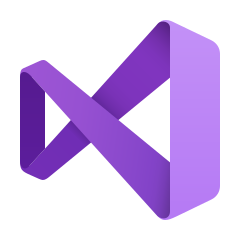

# 🏊🏼‍♂️️ Chas Nolte

**`Software Engineer (Developer/Athlete/Creator)`**

I am a full-stack developer currently pursuing my Masters degree in computer science 
with a concentration in Artificial Intelligence.
All coding projects are built from the ground up, from planning and designing all the way to solving real-life problems with code.
Projects in this repository were built both in a university setting and by myself based on my personal interests.

---

## 🛠️ Languages and Tools

    
    
    
    
    
    
    
    
    
    
    
    
    

---------

## 🚀 Projects

### [Swim Stroke Analyzer](https://github.com/noltechas/SwimAI)
#### Completed December 2023
_For my final project in my Advanced Artificial Intelligence class, I decided to create
a project that analyzes a swimmer's stroke technique. As a collegiate swimmer, the idea
of this project was very interesting to me, as it applied to a sport that I was
competing in and practicing many hours a day. The final project used machine learning algorithms 
built with Keras and Tensorflow to successfully detect the location of the swimmer's
hands and feet throughout a given video. From there, the program measured the symmetry of the
swimmer's features to give accurate feedback to how well the swimmer was performing
their stroke._

  

_The example above shows the neural network's detections of the swimmer's body, as well as the detections
for both their hands and feet. The software then connects the center of the hand and foot bounding
boxes with a line, which is colored green in frames where they are symmetrical to each other, and fading
to red the more asymmetrical they are. In the top left corner, you can see the average angle of these lines
to measure symmetry throughout the entire video._

---

### [Fantasy Football Leaderboard](https://github.com/noltechas/FantasyFootballGUI)
#### Completed September 2023
_This was a personal project used to help manage and share standings for 
a fantasy football league this past season. The league consisted of 128 teams,
spread out through 8 different individual leagues. Other multi-league fantasy
contests often rely on manual standings calculations. However, by using the
Sleeper Fantasy Football API, I was able to create a program that instantly 
calculated the standings for all the leagues and grouped the teams together._

  
  

_The screenshot example on the left shows the standings for an individual league.
The leagues were split up into two divisions, each shown on the left and right side.
The screenshot example on the right shows the right-half of the playoff bracket. This was
calculated using combined teams from all 8 leagues, with the top 24 teams making the playoffs.
The screenshots were generated automatically by the program and required no additional
input from me._

---

<!-- Repeat for more projects -->
