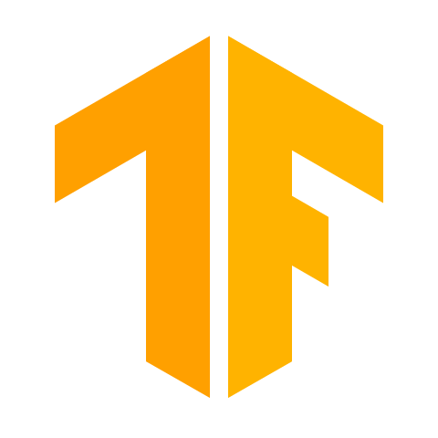

# 🏊🏼‍♂️️ Chas Nolte

**`Software Engineer (Developer/Athlete/Creator)`**

I am a full-stack developer currently pursuing my Masters degree in computer science 
with a concentration in Artificial Intelligence.
All coding projects are built from the ground up, from planning and designing all the way to solving real-life problems with code.
Projects in this repository were built both in a university setting and by myself based on my personal interests.

---

## 🛠️ Languages and Tools

    
    
    
    
    
    
    
    
    
    
    
    
    

